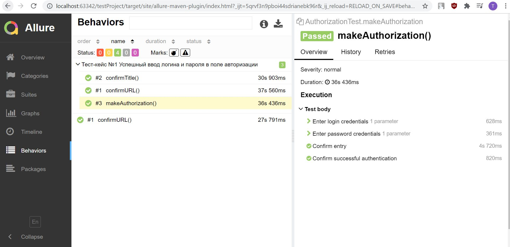

###Тестовый проект страницы авторизации
#####Тесты находятся в классе BaseTest и AuthorizationTest, написаны в соответствии с паттерном PageObject.
#####Подключена отчетность Allure, сформировать отчет можно предварительно прогнав тесты, далее запустить команду "mvn allure:report", результат отчета будет находится в папке target/site.

Пример отчета
